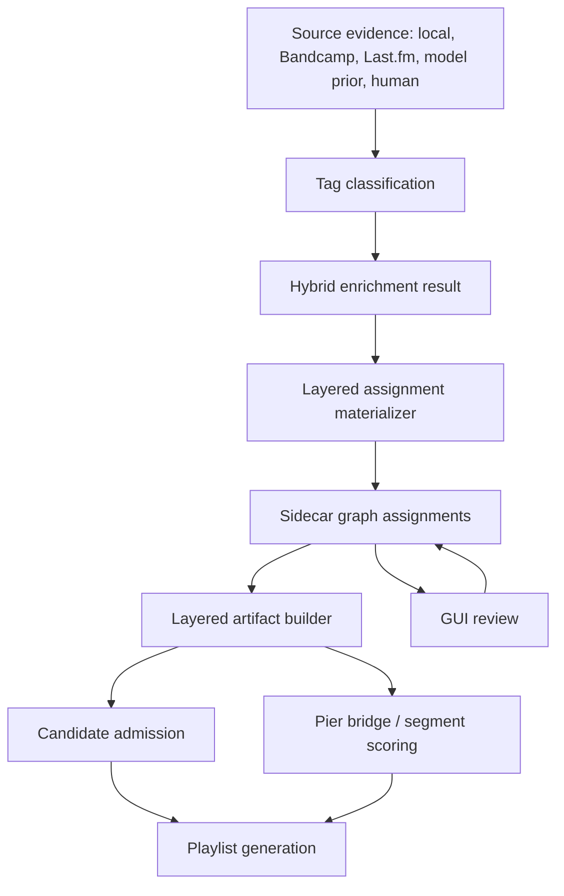

# Layered Genre Graph Implementation Plan

> **For agentic workers:** REQUIRED SUB-SKILL: Use `superpowers:subagent-driven-development` recommended, or `superpowers:executing-plans`, to implement this plan task by task. Steps use checkbox syntax for tracking.

**Goal:** Build a sidecar-first Layered Genre Graph that separates family, leaf genre/style, facets, and bridge permissions, then wire AI genre enrichment so it automatically produces graph-aligned assignments instead of only flat genre tags.

**Architecture:** Add canonical taxonomy and assignment tables to the AI genre sidecar DB, materialize layered release assignments from existing enrichment evidence, build layered vectors into artifacts behind an opt-in flag, and progressively use those vectors for candidate admission, bridge scoring, diagnostics, and GUI review.

**Tech Stack:** Python 3.11+, SQLite sidecar DB, PySide6 GUI, NumPy/SciPy sparse matrices, pytest.

---

## Source Spec

Primary design source:

- `docs/LAYERED_GENRE_GRAPH_SPEC.md`

Implementation must preserve the intent of that spec:

- Broad family tags are useful context, not enough by themselves for strict/narrow admission.
- Specific genre/style tags drive precise matching.
- Facets explain compatibility across genre boundaries but are not genres.
- Bridge edges allow cross-genre movement only when sonic/facet/transition evidence supports it.
- Human rejects override automated evidence.
- First implementation is sidecar-only and must not mutate `data/metadata.db`.

## Non-Goals

- Do not attempt to create a perfect genre taxonomy in the first pass.
- Do not replace all existing flat genre behavior in one release.
- Do not write to `data/metadata.db`.
- Do not make external APIs required for runtime playlist generation.
- Do not use model prior as a final authority. It can propose evidence, but graph assignment needs source reliability, taxonomy, and review policy.

## Rollout Model

Use three runtime modes:

| Mode | Meaning | Default |
| --- | --- | --- |
| `legacy` | Existing flat genre vectors and scoring only | Yes |
| `layered_shadow` | Build layered graph/vectors and diagnostics, but keep legacy decisions | No |
| `layered` | Use layered admission/scoring decisions | No |

Recommended config shape:

```yaml
genre_graph:
  enabled: false
  source: legacy
  taxonomy_version: v0
  broad_only_policy: penalize
  artifacts:
    emit_layered_vectors: false
  enrichment:
    materialize_assignments: true
    auto_infer_parents: true
```

The first merge should ship `legacy` as default, `layered_shadow` available for auditing, and no user-visible behavior changes unless explicitly enabled.

---

## Current Code Touchpoints

Read these before implementation:

- `src/ai_genre_enrichment/storage.py`
- `src/ai_genre_enrichment/tag_classification.py`
- `src/ai_genre_enrichment/hybrid_evidence.py`
- `src/ai_genre_enrichment/hybrid_inference.py`
- `src/ai_genre_enrichment/artifact_modes.py`
- `scripts/ai_genre_enrich.py`
- `src/analyze/artifact_builder.py`
- `scripts/build_beat3tower_artifacts.py`
- `src/playlist/candidate_pool.py`
- `src/playlist/pier_bridge_builder.py`
- `src/playlist/segment_pool_builder.py`
- `src/playlist/mode_presets.py`
- `src/playlist_gui/main_window.py`
- `src/playlist_gui/worker.py`

Do not assume older "prior model" docs describe the target system. The target is the Layered Genre Graph spec.

---

## Phase 0: Guardrails and Baseline Tests

Purpose: lock down current behavior before adding graph behavior.

### Files

- Modify tests only at first.
- Add focused tests under `tests/unit/`.

### Tasks

- [ ] Add a regression test proving human-rejected tags never reappear in accepted enriched genres.
- [ ] Add a regression test proving Last.fm-only unknown tags are not promoted to confident genre/style assignments.
- [ ] Add a regression test proving `hybrid-enrich-one --apply` can enrich one release without rebuilding unrelated artist signatures.
- [ ] Add a regression test proving legacy artifact generation still emits current keys:
  - `X_genre_raw`
  - `X_genre_smoothed`
  - `genre_vocab`
- [ ] Add a regression test proving `genre_source: legacy` remains behaviorally unchanged.

### Suggested Tests

```powershell
pytest -q tests/unit/test_ai_genre_hybrid_evidence.py
pytest -q tests/unit/test_ai_genre_hybrid_cli.py
pytest -q tests/unit/test_ai_genre_artifact_modes.py
```

### Acceptance

- Existing enrichment fixes remain stable before graph work begins.
- No graph code is needed to pass this phase.

---

## Phase 1: Taxonomy Schema and Seed Registry

Purpose: introduce canonical genres, facets, aliases, and graph edges in the sidecar DB.

### Files

Create:

- `data/layered_genre_taxonomy.yaml`
- `src/ai_genre_enrichment/layered_taxonomy.py`
- `tests/unit/test_layered_genre_taxonomy.py`

Modify:

- `src/ai_genre_enrichment/storage.py`
- `scripts/ai_genre_enrich.py`

### Sidecar Tables

Add these tables through `SidecarStore.initialize()`:

```sql
genre_graph_canonical_genres (
    genre_id TEXT PRIMARY KEY,
    name TEXT NOT NULL UNIQUE,
    kind TEXT NOT NULL,
    specificity_score REAL NOT NULL,
    status TEXT NOT NULL,
    taxonomy_version TEXT NOT NULL
);

genre_graph_aliases (
    alias TEXT PRIMARY KEY,
    canonical_genre_id TEXT NOT NULL,
    source TEXT NOT NULL,
    confidence REAL NOT NULL
);

genre_graph_edges (
    source_genre_id TEXT NOT NULL,
    target_genre_id TEXT NOT NULL,
    edge_type TEXT NOT NULL,
    weight REAL NOT NULL,
    confidence REAL NOT NULL,
    source TEXT NOT NULL,
    notes TEXT,
    PRIMARY KEY (source_genre_id, target_genre_id, edge_type)
);

genre_graph_canonical_facets (
    facet_id TEXT PRIMARY KEY,
    name TEXT NOT NULL UNIQUE,
    facet_type TEXT NOT NULL,
    status TEXT NOT NULL
);

genre_graph_bridge_rules (
    source_genre_id TEXT NOT NULL,
    target_genre_id TEXT NOT NULL,
    required_family_min REAL NOT NULL,
    required_facet_overlap REAL NOT NULL,
    required_sonic_similarity REAL NOT NULL,
    required_transition_quality REAL NOT NULL,
    mode_allowed TEXT NOT NULL,
    notes TEXT,
    PRIMARY KEY (source_genre_id, target_genre_id)
);
```

### Seed Taxonomy Requirements

Start small and curated. Include only stable high-value entries:

- Families:
  - `rock`
  - `pop`
  - `electronic`
  - `folk`
  - `jazz`
  - `hip hop`
  - `punk`
  - `metal`
  - `ambient/new age`
  - `r&b/soul`
  - `country/roots`
  - `classical/modern composition`
  - `experimental`
- Leaf styles:
  - `indie pop`
  - `jangle pop`
  - `twee pop`
  - `synth-pop`
  - `slowcore`
  - `shoegaze`
  - `dream pop`
  - `post-rock`
  - `post-punk`
  - `dance-punk`
  - `avant-folk`
  - `indie folk`
  - `american primitivism`
  - `ambient americana`
  - `ambient dub`
  - `experimental ambient`
  - `ambient pop`
- Facets:
  - `lo-fi`
  - `noisy`
  - `pastoral`
  - `acoustic`
  - `synth-heavy`
  - `danceable`
  - `melancholic`
  - `minimal`
  - `warm`
  - `reverb-heavy`
  - `female vocals`
  - `instrumental`
  - `drum machine`
  - `diy`
- Bridge edges:
  - `indie pop` <-> `synth-pop`
  - `jangle pop` <-> `twee pop`
  - `shoegaze` <-> `dream pop`
  - `avant-folk` <-> `indie folk`
  - `ambient americana` <-> `american primitivism`
  - `post-punk` <-> `dance-punk`

### CLI

Add:

```text
python scripts/ai_genre_enrich.py graph-init
python scripts/ai_genre_enrich.py graph-report
```

`graph-init` should:

- Load `data/layered_genre_taxonomy.yaml`.
- Upsert canonical genres, aliases, facets, edges, and bridge rules.
- Be idempotent.
- Write only to the sidecar DB.

`graph-report` should show:

- Taxonomy version.
- Counts by genre kind.
- Counts by facet type.
- Alias count.
- Edge count by type.
- Deprecated/review entries.

### Tests

```powershell
pytest -q tests/unit/test_layered_genre_taxonomy.py
```

### Acceptance

- Sidecar initializes all graph tables.
- Taxonomy load is deterministic and idempotent.
- Alias lookup canonicalizes simple cases.
- No main metadata DB writes occur.

---

## Phase 2: Layered Assignment Materialization

Purpose: convert enriched evidence into graph-aligned release genre/facet assignments.

### Files

Create:

- `src/ai_genre_enrichment/layered_assignment.py`
- `tests/unit/test_layered_genre_assignments.py`

Modify:

- `src/ai_genre_enrichment/storage.py`
- `src/ai_genre_enrichment/hybrid_evidence.py`
- `src/ai_genre_enrichment/tag_classification.py`

### New Assignment Tables

```sql
genre_graph_release_genre_assignments (
    release_id TEXT NOT NULL,
    artist TEXT NOT NULL,
    album TEXT NOT NULL,
    genre_id TEXT NOT NULL,
    assignment_layer TEXT NOT NULL,
    confidence REAL NOT NULL,
    source_reliability REAL NOT NULL,
    evidence_count INTEGER NOT NULL,
    rejected_by_user INTEGER NOT NULL DEFAULT 0,
    provenance_json TEXT NOT NULL,
    updated_at TEXT NOT NULL,
    PRIMARY KEY (release_id, genre_id, assignment_layer)
);

genre_graph_release_facet_assignments (
    release_id TEXT NOT NULL,
    artist TEXT NOT NULL,
    album TEXT NOT NULL,
    facet_id TEXT NOT NULL,
    confidence REAL NOT NULL,
    source TEXT NOT NULL,
    provenance_json TEXT NOT NULL,
    updated_at TEXT NOT NULL,
    PRIMARY KEY (release_id, facet_id, source)
);
```

### Assignment Layers

Use these exact layer labels:

- `observed_leaf`
- `inferred_parent`
- `inferred_family`
- `model_prior`
- `human`

Observed means directly supported by accepted evidence. Inferred means propagated from taxonomy edges. Model prior means LLM support without enough independent source evidence. Human means user-provided or explicitly approved.

### Materialization Rules

Implement a function shaped like:

```python
materialize_layered_assignments(
    store: SidecarStore,
    release_key: ReleaseKey,
    enriched_result: HybridEnrichmentResult,
    taxonomy: LayeredTaxonomy,
) -> LayeredAssignmentSummary
```

Rules:

- Canonicalize accepted genres through aliases.
- Treat canonical family-only terms as `inferred_family` unless human-entered.
- Treat canonical leaf/subgenre/microgenre terms as `observed_leaf`.
- Propagate parents via `is_a` edges into `inferred_parent` and `inferred_family`.
- Assign facets from source descriptors and classifier output.
- Never store rejected human terms as active assignments.
- Store rejected user terms as `rejected_by_user=1` only where needed for diagnostics.
- Preserve provenance for each assignment:
  - source names
  - source weights
  - raw tags
  - normalized term
  - classifier basis
  - human override state

### Source Reliability Policy

Initial weights:

| Source | Reliability |
| --- | ---: |
| human approved | 1.00 |
| official artist/label/release text | 0.95 |
| Bandcamp release metadata | 0.90 |
| Discogs/MusicBrainz normalized metadata | 0.75 |
| local metadata | 0.70 |
| model prior with strict verification | 0.60 |
| Last.fm specific canonical style | 0.45 |
| Last.fm broad tag | 0.20 |
| Last.fm unknown phrase | 0.05 |

These weights are not final truth. They are tunable starting points.

### Tests

```powershell
pytest -q tests/unit/test_layered_genre_assignments.py
```

### Acceptance

- `jangle pop` produces observed `jangle pop` plus inferred parents/families.
- `rock` alone does not become an observed leaf.
- `lo-fi` becomes a facet unless part of a canonical genre phrase.
- `japanese` becomes a region/context facet or review item, not a genre.
- `seen live`, `favorite`, `spotify`, and similar terms are rejected as noise.
- Human rejects win over all automated evidence.

---

## Phase 3: Wire the AI Genre Enrichment CLI End to End

Purpose: make enrichment automatically refresh layered assignments whenever it produces or applies enriched genres.

### Files

Modify:

- `scripts/ai_genre_enrich.py`
- `src/ai_genre_enrichment/hybrid_inference.py`
- `src/ai_genre_enrichment/storage.py`
- `tests/unit/test_ai_genre_hybrid_cli.py`
- `tests/unit/test_layered_genre_cli.py`

Create:

- `tests/unit/test_layered_genre_cli.py`

### CLI Updates

Add commands:

```text
python scripts/ai_genre_enrich.py graph-build-assignments --artist "Duster" --album "Stratosphere"
python scripts/ai_genre_enrich.py graph-show-release --artist "Duster" --album "Stratosphere"
python scripts/ai_genre_enrich.py graph-report
```

`graph-build-assignments` should:

- Read existing sidecar source evidence and enriched results.
- Materialize assignments for one release, one artist, or all releases.
- Support `--dry-run`.
- Support `--artist`.
- Support `--album`.
- Never write to `data/metadata.db`.

`graph-show-release` should print:

- Observed leaf genres.
- Inferred parents.
- Inferred families.
- Facets.
- Rejected/noise terms.
- Human overrides.
- Evidence source summary.

Update existing commands:

- `hybrid-enrich-one --apply` should call assignment materialization after replacing flat enriched genres.
- Artist/full-scan enrichment should refresh assignments per release after each successful `hybrid-enrich-one`.
- `--dry-run` should show the layered assignment summary but not write it.
- `--no-rebuild-signatures` should remain respected.

### Important Behavior Change

The enrichment tool should no longer treat "accepted flat genres" as the only output. The correct outputs become:

- Flat enriched genres retained for compatibility.
- Layered release genre assignments.
- Layered release facet assignments.
- Rejected/noise evidence records.
- Diagnostics explaining promotion, demotion, and propagation.

### Tests

```powershell
pytest -q tests/unit/test_ai_genre_hybrid_cli.py tests/unit/test_layered_genre_cli.py
```

### Acceptance

- Running `hybrid-enrich-one --apply` produces both legacy enriched genres and graph assignments.
- Running `graph-show-release` explains why broad terms were family-only.
- Last.fm-only noise phrases cannot become confident observed leaf assignments.
- Trap releases with no reliable source evidence do not get confident model-prior assignments.

---

## Phase 4: Classifier and Noise Policy Upgrade

Purpose: classify source terms into canonical genre/style, family, facet, alias, review, or reject before scoring.

### Files

Modify:

- `src/ai_genre_enrichment/tag_classification.py`
- `src/ai_genre_enrichment/hybrid_evidence.py`
- `src/ai_genre_enrichment/model_prior.py` if present in current branch
- `tests/unit/test_ai_genre_tag_classification.py`
- `tests/unit/test_layered_noise_policy.py`

Create:

- `tests/unit/test_layered_noise_policy.py`

### Classification Buckets

Use exact normalized buckets:

- `canonical_genre`
- `family`
- `facet`
- `alias`
- `review`
- `reject`

### Rules

- `rock`, `pop`, `electronic`, `folk`, and similar broad terms map to family.
- `indie` maps to broad context/family unless part of a canonical phrase such as `indie pop` or `indie folk`.
- `lo-fi` maps to facet unless part of a curated canonical genre phrase.
- Region terms such as `japanese` map to facet/context or review, not genre.
- Joke tags, platform tags, ownership tags, formats, and trivia map to reject.
- Unknown Last.fm phrases map to review or reject unless corroborated by reliable source evidence.
- Model prior can suggest genre candidates, but cannot promote a term that fails taxonomy/source policy.

### Tests

```powershell
pytest -q tests/unit/test_ai_genre_tag_classification.py tests/unit/test_layered_noise_policy.py
```

### Acceptance

- Ada Lea style noise such as `mixtaperoom`, `rare sad girl`, and `rare sads` is rejected or sent to review.
- Miyauchi Yuri style cases are not guessed from name or region.
- Fictional artist/album traps remain low confidence and do not produce confident accepted assignments.

---

## Phase 5: Layered Artifact Support

Purpose: emit graph-aware matrices without removing existing flat vectors.

### Files

Create:

- `src/ai_genre_enrichment/layered_vectors.py`
- `tests/unit/test_layered_artifact_builder.py`

Modify:

- `src/analyze/artifact_builder.py`
- `src/ai_genre_enrichment/artifact_modes.py`
- `scripts/build_beat3tower_artifacts.py`
- `tests/unit/test_ai_genre_artifact_modes.py`

### Artifact Keys

Keep existing keys:

- `X_genre_raw`
- `X_genre_smoothed`
- `genre_vocab`

Add optional layered keys when enabled:

- `X_genre_leaf_idf`
- `X_genre_family`
- `X_genre_bridge`
- `X_facet`
- `genre_leaf_vocab`
- `genre_family_vocab`
- `genre_bridge_vocab`
- `facet_vocab`
- `genre_graph_taxonomy_version`
- `genre_graph_sidecar_fingerprint`

### Vector Construction

`X_genre_leaf_idf`:

- observed leaf/subgenre/microgenre only
- IDF-weighted
- high influence in strict/narrow modes

`X_genre_family`:

- inferred family memberships
- lower weight
- supports neighborhood compatibility and fallback

`X_genre_bridge`:

- graph-derived bridge affordance vector
- represents reachable bridge edges and close sibling paths

`X_facet`:

- mood, texture, production, instrumentation, era, region, scene facets
- used for cross-boundary validation

### Shadow Mode

Add `layered_shadow` to artifact source handling:

- Build layered artifacts.
- Keep existing playlist decisions.
- Emit diagnostics comparing legacy and layered decisions where practical.

### Tests

```powershell
pytest -q tests/unit/test_layered_artifact_builder.py tests/unit/test_ai_genre_artifact_modes.py
```

### Acceptance

- Legacy artifacts still build unchanged by default.
- Layered artifact build emits all new keys when enabled.
- Fingerprint changes when taxonomy or sidecar assignments change.
- Missing graph assignments degrade gracefully to legacy vectors.

---

## Phase 6: Layered Genre Scoring Module

Purpose: create the scoring engine before wiring it into candidate selection.

### Files

Create:

- `src/playlist/layered_genre_scoring.py`
- `tests/unit/test_layered_genre_scoring.py`

Modify:

- `src/playlist/mode_presets.py`

### Data Classes

Implement structures equivalent to:

```python
LayeredGenreComponents:
    family_affinity: float
    niche_similarity: float
    facet_alignment: float
    bridge_permission: float
    broad_only_penalty: float
    unexplained_jump_penalty: float
    source_quality: float

LayeredGenreDecision:
    admitted: bool
    score: float
    components: LayeredGenreComponents
    reason: str
```

### Candidate Score

Use the spec formula:

```python
genre_score =
    w_family * family_affinity
  + w_leaf * niche_similarity
  + w_facet * facet_alignment
  + w_bridge * bridge_permission
  - w_broad_only * broad_only_penalty
```

### Transition Score

Use the spec formula:

```python
edge_genre_score =
    local_family_continuity
  + local_leaf_continuity
  + bridge_edge_bonus
  + facet_continuity
  - unexplained_family_jump_penalty
```

### Mode Preset Starting Points

| Mode | Leaf Requirement | Family Only | Bridge Use |
| --- | --- | --- | --- |
| `strict` | high | reject | rare |
| `narrow` | medium/high | reject unless exceptional sonic/facet evidence | limited |
| `dynamic` | medium | penalize | allowed with evidence |
| `discover` | low/medium | allowed with strong sonic/facet evidence | broad |
| `off` | none | ignored | ignored |

### Tests

```powershell
pytest -q tests/unit/test_layered_genre_scoring.py
```

### Acceptance

- Broad-only overlap cannot pass strict or narrow by itself.
- Specific shared leaf tags strongly improve strict/narrow admission.
- Known bridge edges help only when mode and evidence allow them.
- Facets help explain cross-genre movement but do not replace genre evidence.

---

## Phase 7: Candidate Admission Integration

Purpose: use layered scores for candidate pool construction behind config.

### Files

Modify:

- `src/playlist/candidate_pool.py`
- `src/playlist/pipeline.py`
- `src/playlist_generator.py`
- `src/config_loader.py`
- `tests/unit/test_layered_candidate_admission.py`

Create:

- `tests/unit/test_layered_candidate_admission.py`

### Integration Rules

- Keep `genre_mode` values as first-class UX:
  - `strict`
  - `narrow`
  - `dynamic`
  - `discover`
  - `off`
- Add layered scoring only when `genre_graph.source` is `layered_shadow` or `layered`.
- In `layered_shadow`, compute layered diagnostics but use existing admission decisions.
- In `layered`, use `LayeredGenreDecision.admitted`.
- Preserve current IDF and coverage behavior as part of leaf scoring.
- Fix max-over-seeds behavior where it lets one broad match dominate a multi-seed route.

### Broad-Only Policy

Candidates with only generic overlap such as:

- `rock`
- `pop`
- `indie`
- `alternative`

should fail strict/narrow unless:

- strong sonic similarity clears the mode threshold,
- facet evidence is strong,
- and a graph bridge or family/sibling explanation exists.

### Diagnostics

For each admitted/rejected candidate, log:

- `family_affinity`
- `niche_similarity`
- `facet_alignment`
- `bridge_permission`
- `broad_only_penalty`
- `source_quality`
- final decision
- reason

### Tests

```powershell
pytest -q tests/unit/test_layered_candidate_admission.py
```

### Acceptance

- Legacy candidate admission is unchanged by default.
- Strict/narrow no longer admit broad-only generic matches.
- Dynamic/discover can admit broader candidates when sonic/facet/bridge evidence explains the movement.
- Audit output can explain each genre decision.

---

## Phase 8: Pier Bridge and Segment Pool Integration

Purpose: make bridge routing use graph/facet evidence without losing current vector-mode strengths.

### Files

Modify:

- `src/playlist/pier_bridge_builder.py`
- `src/playlist/segment_pool_builder.py`
- `tests/unit/test_layered_bridge_scoring.py`
- existing pier bridge tests as needed

Create:

- `tests/unit/test_layered_bridge_scoring.py`

### Integration Rules

- Keep current multi-genre vector interpolation.
- Add layered transition scoring as an additional component when enabled.
- Penalize unexplained family jumps.
- Reward graph bridge edges only when:
  - graph edge exists or path is close enough,
  - facet overlap clears mode threshold,
  - sonic similarity clears mode threshold,
  - transition quality clears mode threshold,
  - no hard conflict exists.

### Example Expected Decisions

Allowed in dynamic mode with evidence:

- `indie pop` -> `synth-pop`
- `shoegaze` -> `dream pop`
- `avant-folk` -> `indie folk`
- `ambient americana` -> `american primitivism`

Penalized unless strongly explained:

- `indie pop` -> `techno`
- `slowcore` -> `death metal`
- `jangle pop` -> `hardcore punk`

### Diagnostics

For each evaluated transition, report:

- from genre signature
- to genre signature
- bridge edge used
- graph path length if no direct edge
- sonic similarity
- facet overlap
- transition quality
- explained or penalized jump

### Tests

```powershell
pytest -q tests/unit/test_layered_bridge_scoring.py
```

### Acceptance

- Pier bridge still optimizes worst transition quality.
- Layered scoring prevents hub-family collapse.
- Cross-genre movement is explainable in diagnostics.

---

## Phase 9: GUI Review and User Control

Purpose: expose layered assignments so the user can edit genres/facets/rejects directly.

### Files

Modify:

- `src/playlist_gui/main_window.py`
- `src/playlist_gui/worker.py`
- GUI genre enrichment/review modules currently in the branch
- GUI tests as available

### GUI Requirements

Update the Genre Enrichment window to show:

- Observed leaf genres.
- Inferred parents/families.
- Facets.
- Rejected/noise terms.
- Source evidence.
- Human override status.

User actions:

- Approve a proposed leaf genre.
- Reject a genre or source tag.
- Move a term from genre to facet.
- Move a term from facet to genre only if it is in taxonomy or explicitly added as review.
- Add a manual genre.
- Add a manual facet.
- Refresh graph assignments for selected release.
- Rebuild artifacts after review.

### Worker Commands

Add worker messages for:

- `graph_show_release`
- `graph_build_assignments`
- `graph_review_update`
- `graph_report`

### Acceptance

- Human edits write only to sidecar.
- GUI displays inferred layers separately from observed/human layers.
- Rejected terms cannot silently return on the next enrichment run.
- The user can run small-batch enrichment and immediately review/edit results.

---

## Phase 10: Reports, Audit, and Migration Docs

Purpose: make the new system observable and safe to roll out.

### Files

Create or modify:

- `docs/LAYERED_GENRE_GRAPH_MIGRATION.md`
- `docs/AI_GENRE_ENRICHMENT_WORKFLOW.md` if present, otherwise create it
- `tests/unit/test_layered_diagnostics.py`

### CLI Reports

Add report modes:

```text
python scripts/ai_genre_enrich.py graph-report
python scripts/ai_genre_enrich.py graph-report --broad-only
python scripts/ai_genre_enrich.py graph-report --needs-review
python scripts/ai_genre_enrich.py graph-report --rejected
python scripts/ai_genre_enrich.py graph-show-release --artist "Mount Eerie" --album "Sauna"
```

### Report Content

Library-level:

- count of releases with rich layered metadata
- count of broad-only releases
- count of unknown releases
- top leaf genres
- top families
- top facets
- noisy source tags rejected
- terms needing taxonomy review

Release-level:

- source evidence quality
- observed leaf assignments
- inferred assignments
- facet assignments
- rejected terms
- human overrides
- final flat compatibility genres

### Acceptance

- A user can tell why a genre was accepted, demoted to family, moved to facet, or rejected.
- Migration docs explain how to use `legacy`, `layered_shadow`, and `layered`.
- No one needs to guess whether Bandcamp/Last.fm/model prior was the reason a genre appeared.

---

## End-to-End Implementation Order

Use this order. Do not jump straight into GUI or generation scoring before assignments and diagnostics work.

- [ ] Phase 0: Baseline guardrails.
- [ ] Phase 1: Taxonomy schema and seed registry.
- [ ] Phase 2: Layered assignment materialization.
- [ ] Phase 3: Enrichment CLI wiring.
- [ ] Phase 4: Classifier/noise policy upgrade.
- [ ] Phase 5: Layered artifact support in shadow mode.
- [ ] Phase 6: Layered scoring module.
- [ ] Phase 7: Candidate admission integration.
- [ ] Phase 8: Pier bridge and segment pool integration.
- [ ] Phase 9: GUI review and control.
- [ ] Phase 10: Reports, audit, and migration docs.

---

## TDD Checklist

### Unit Tests First

- [ ] `test_layered_genre_taxonomy.py`
- [ ] `test_layered_genre_assignments.py`
- [ ] `test_layered_genre_cli.py`
- [ ] `test_layered_noise_policy.py`
- [ ] `test_layered_artifact_builder.py`
- [ ] `test_layered_genre_scoring.py`
- [ ] `test_layered_candidate_admission.py`
- [ ] `test_layered_bridge_scoring.py`
- [ ] `test_layered_diagnostics.py`

### Focused Verification Commands

```powershell
pytest -q tests/unit/test_layered_genre_taxonomy.py
pytest -q tests/unit/test_layered_genre_assignments.py
pytest -q tests/unit/test_layered_genre_cli.py
pytest -q tests/unit/test_layered_noise_policy.py
pytest -q tests/unit/test_layered_artifact_builder.py
pytest -q tests/unit/test_layered_genre_scoring.py
pytest -q tests/unit/test_layered_candidate_admission.py
pytest -q tests/unit/test_layered_bridge_scoring.py
pytest -q tests/unit/test_layered_diagnostics.py
```

### Existing Regression Commands

```powershell
pytest -q tests/unit/test_ai_genre_hybrid_evidence.py
pytest -q tests/unit/test_ai_genre_hybrid_cli.py
pytest -q tests/unit/test_ai_genre_artifact_modes.py
pytest -q tests/unit/test_pipeline_switch.py
```

### Final Focused Suite

```powershell
pytest -q tests/unit/test_ai_genre_hybrid_evidence.py tests/unit/test_ai_genre_hybrid_cli.py tests/unit/test_ai_genre_artifact_modes.py tests/unit/test_layered_genre_taxonomy.py tests/unit/test_layered_genre_assignments.py tests/unit/test_layered_genre_cli.py tests/unit/test_layered_noise_policy.py tests/unit/test_layered_artifact_builder.py tests/unit/test_layered_genre_scoring.py tests/unit/test_layered_candidate_admission.py tests/unit/test_layered_bridge_scoring.py tests/unit/test_layered_diagnostics.py
```

---

## Manual Smoke Tests

Use these after CLI wiring and before GUI integration.

### Initialize Graph

```powershell
python scripts\ai_genre_enrich.py graph-init
python scripts\ai_genre_enrich.py graph-report
```

Expected:

- graph tables exist in sidecar DB
- taxonomy counts print
- command is idempotent

### Known Release

```powershell
python scripts\ai_genre_enrich.py hybrid-enrich-one --artist "Duster" --album "Stratosphere" --dry-run
python scripts\ai_genre_enrich.py graph-build-assignments --artist "Duster" --album "Stratosphere" --dry-run
python scripts\ai_genre_enrich.py graph-show-release --artist "Duster" --album "Stratosphere"
```

Expected:

- `slowcore`, `space rock`, `shoegaze`, or similar terms appear as observed/review depending source evidence.
- broad `rock` appears as family/inferred context.
- Last.fm-only broad/noisy tags do not appear as observed leaf assignments.

### Noise Trap

```powershell
python scripts\ai_genre_enrich.py graph-build-assignments --artist "Ada Lea" --dry-run
python scripts\ai_genre_enrich.py graph-show-release --artist "Ada Lea"
```

Expected:

- `mixtaperoom`, `rare sad girl`, and `rare sads` are rejected or review-only.
- They do not become accepted leaf genres.

### Fictional Trap

```powershell
python scripts\ai_genre_enrich.py hybrid-enrich-one --artist "Donna Hafford" --album "Porch Swing Poppy" --dry-run
```

Expected:

- model prior does not produce confident accepted assignments without reliable external/source evidence.

### Layered Artifact Shadow

```powershell
python scripts\ai_genre_enrich.py rebuild-artifacts --genre-source layered_shadow --dry-run
```

Expected:

- legacy artifacts remain available
- layered artifact keys are planned or emitted depending phase completion
- no main metadata writes

---

## Implementation Details by Component

### `layered_taxonomy.py`

Responsibilities:

- Load YAML taxonomy.
- Validate schema.
- Normalize names.
- Resolve aliases.
- Expose canonical genre/facet lookup.
- Traverse parent/family edges.
- Expose bridge edges and bridge rules.

Suggested public functions:

```python
load_layered_taxonomy(path: Path) -> LayeredTaxonomy
normalize_taxonomy_name(value: str) -> str
canonicalize_genre_name(taxonomy: LayeredTaxonomy, value: str) -> CanonicalGenre | None
canonicalize_facet_name(taxonomy: LayeredTaxonomy, value: str) -> CanonicalFacet | None
parents_for_genre(taxonomy: LayeredTaxonomy, genre_id: str) -> list[CanonicalGenre]
families_for_genre(taxonomy: LayeredTaxonomy, genre_id: str) -> list[CanonicalGenre]
bridge_rule_for(taxonomy: LayeredTaxonomy, source_id: str, target_id: str) -> BridgeRule | None
```

### `layered_assignment.py`

Responsibilities:

- Convert enrichment evidence into graph assignments.
- Apply source reliability.
- Apply taxonomy propagation.
- Respect human rejects.
- Store release-level genre and facet assignments.

Suggested public functions:

```python
materialize_layered_assignments(...) -> LayeredAssignmentSummary
summarize_release_layered_assignments(...) -> ReleaseLayeredGenreSummary
classify_layered_term(...) -> LayeredTermClassification
```

### `layered_vectors.py`

Responsibilities:

- Build layered sparse/dense matrices from sidecar assignments.
- Compute IDF for leaf genres.
- Build family/facet/bridge vocabularies.
- Provide artifact-ready arrays and metadata.

Suggested public functions:

```python
build_layered_genre_matrices(track_release_map, assignments, taxonomy) -> LayeredGenreMatrices
compute_leaf_idf(assignments) -> dict[str, float]
build_bridge_affordance_vector(release_assignments, taxonomy) -> np.ndarray
```

### `layered_genre_scoring.py`

Responsibilities:

- Candidate admission components.
- Transition scoring components.
- Mode thresholds.
- Diagnostic payloads.

Suggested public functions:

```python
compute_layered_candidate_components(...) -> LayeredGenreComponents
decide_layered_candidate_admission(...) -> LayeredGenreDecision
compute_layered_transition_components(...) -> LayeredTransitionComponents
score_layered_transition(...) -> LayeredTransitionDecision
```

---

## Data Flow



---

## Acceptance Criteria

- [ ] Flat genre behavior remains available behind a config flag during migration.
- [ ] Existing tests still pass.
- [ ] Taxonomy versioning exists.
- [ ] All new graph data is sidecar-only.
- [ ] Human rejects remain respected.
- [ ] Broad-only tags cannot dominate strict/narrow generation.
- [ ] Specific tags retain IDF-like influence.
- [ ] Similar niche genres can connect through shared parents.
- [ ] Cross-genre moves require bridge plus sonic/facet support.
- [ ] Diagnostics can explain why a candidate passed or failed.
- [ ] Enrichment writes layered assignments automatically after successful apply.
- [ ] GUI review can approve, reject, and reclassify terms without touching main metadata.
- [ ] Runtime generation does not require external API calls.

---

## Failure Modes to Watch

- Broad family tags accidentally re-enter strict/narrow as strong evidence.
- Last.fm novelty/noise tags become canonical genres because model prior guessed they were plausible.
- Inferred parents are treated as observed evidence.
- Human rejects are ignored during assignment rebuild.
- `layered_shadow` changes actual generation behavior.
- Artifact cache/fingerprint does not include taxonomy or sidecar assignment state.
- GUI edits update flat enriched genres but not graph assignments.
- Bridge scoring rewards any shared family too strongly and recreates hub collapse.

---

## Recommended Subagent Split

Use parallel agents only after Phase 0 guardrails are written.

Agent A:

- Phase 1 taxonomy schema and seed registry.
- Phase 2 assignment tables and materialization.

Agent B:

- Phase 3 CLI wiring.
- Phase 4 classifier/noise policy tests.

Agent C:

- Phase 5 artifacts.
- Phase 6 scoring module.

Agent D:

- Phase 7 candidate admission.
- Phase 8 pier bridge/segment scoring.

Main session:

- Owns GUI integration, rollout decisions, final review, and merge hygiene.
- Reconciles shared API boundaries between agents.

Do not have multiple agents edit `scripts/ai_genre_enrich.py` or `src/ai_genre_enrichment/storage.py` at the same time.

---

## Stable Stopping Points

If usage or time runs low, stop only at one of these states:

1. **Schema only:** graph tables and taxonomy load exist, tests pass, no runtime behavior changed.
2. **Enrichment materialization:** enrichment can write layered assignments, legacy generation unchanged.
3. **Artifact shadow:** layered artifacts build in shadow mode, generation unchanged.
4. **Scoring shadow:** layered decisions are logged, legacy decisions still used.
5. **Opt-in generation:** layered mode works behind config and diagnostics explain decisions.

Avoid stopping mid-phase with partially wired behavior that silently changes enrichment or generation.

